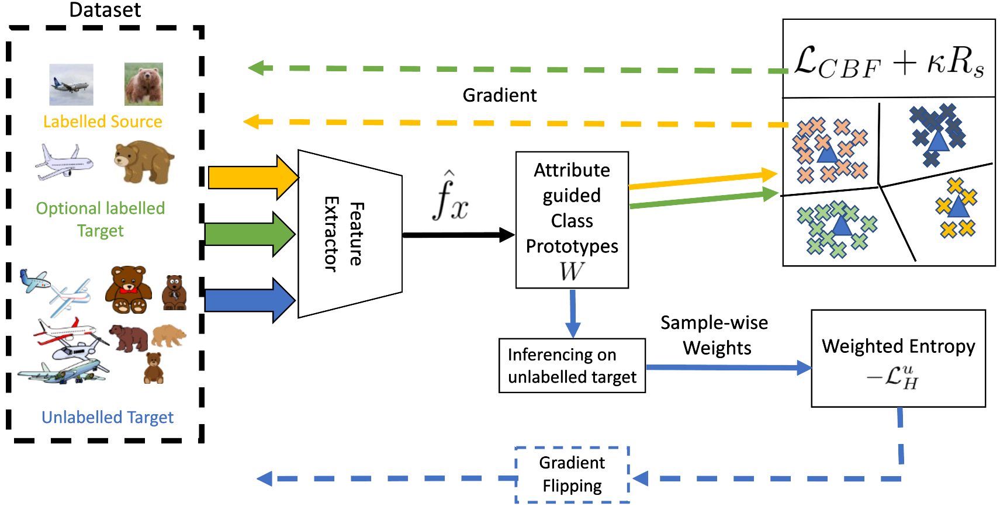

# Handling Class Imbalance in Domain Adaptation

## Install

`pip install -r requirements.txt`

`conda env create -f environment. yml`

`source activate SSDA`

The code is written for Pytorch 0.4.0, but should work for other version
with some modifications.
## Data preparation (DomainNet)

To get data, run

`sh download_data.sh`

The images will be stored in the following way.

`./data/multi/real/category_name`,

`./data/multi/sketch/category_name`

The dataset split files are stored as follows,

`./data/txt/multi/labeled_source_images_real.txt`,

`./data/txt/multi/unlabeled_target_images_sketch_3.txt`,

`./data/txt/multi/validation_target_images_sketch_3.txt`.

With regard to office and office home dataset, store the image files in the following ways,

 `./data/office/amazon/category_name`,
 `./data/office_home/Real/category_name`,

We provide the split of office and office-home.

## Training

To run training using alexnet,

`sh run_train.sh gpu_id method alexnet`

where, gpu_id = 0,1,2,3...., method=[MME,ENT,S+T].

### Reference
This repository is build on top of [MME](hub.com/VisionLearningGroup/SSDA_MME) repo by [Kuniaki Saito](http://cs-people.bu.edu/keisaito/) and [Donghyun Kim](https://cs-people.bu.edu/donhk/).

